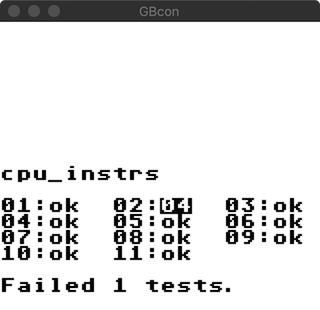

# GBcon

`GBcon` is an Original GameBoy emulator for unix-like platforms written in c++. 

Written for fun.

## Building

GBcon requires SDL2

```sh
git clone https://github.com/connnnor/GBcon
cd GBcon
mkdir build && cd build
cmake .. -DCMAKE_INSTALL_PREFIX=..
make && make install
```

## Usage

```sh
$ ./GBcon --help
Allowed options:
  --help                  Display help message
  -b [ --bios ] arg       path to bios
  -r [ --rom ] arg        path to rom
  -l [ --log ] arg        log directory
  -d [ --dbg ]            start emu in debugger
  -s [ --scale ] arg (=2) display scale. 1, 2, 4

$ ./GBcon --bios gb_bios.gb --rom tetris.gb
```

keys are up, down, left, right, a, s, enter, and right shift

## Running tests

Automated tests use rspec to launch GBcon, load a test rom (blargg's) and interact with the debugger to exit when the test ROM is complete. 
Blargg's roms print their console output to the GameBoy serial port which GBcon dumps upon exit. 

To run rspec tests, do:

`rspec`

## Features

* Passes *most of* blargg's cpu_instr test roms. Currently fails 02-interrupts.gb since the timer is not implemented.
* Memory Bank Controllers: MBC1, MBC3, MBC5. 
* Text based debugger
* Cartridge save support

## Missing features

* Sound
* Memory Bank Controllers: MBC2, MBC6, MBC7, MM01, RTC support
* Accurate intra cycle timing

## Known Issues

* Broken random number generation
* Choppy horizontal scrolling graphics

## Screenshots




[Link](https://github.com/bitnenfer/FlappyBoy) to FlappyBoy game in second screenshot

## References

* [GameBoy CPU Manual](http://marc.rawer.de/Gameboy/Docs/GBCPUman.pdf) An essential resource for most of development. A few inaccuracies.
* [TDD for C++ in CMake And GoogleTest](https://youyue123.github.io/tech/2018/01/29/TDD-for-C++-in-CMake-And-GoogleTest.html)
* [A Look At The Game Boy Bootstrap: Let The Fun Begin!](https://realboyemulator.wordpress.com/2013/01/03/a-look-at-the-game-boy-bootstrap-let-the-fun-begin/) Very useful guide during initial CPU debugging
* [DECODING Z80 OPCODES](http://www.z80.info/decoding.htm) Used for implementing the 0xCB instruction decoding (note the 0xCB instructions are not exactly the same between Gameboy and z80. For opcodes 0xCB30 - 0xCB37 Gameboy has SWAP instructions; z80 has SLLs.
* [TCAGBD](https://github.com/AntonioND/giibiiadvance/blob/master/docs/TCAGBD.pdf)
